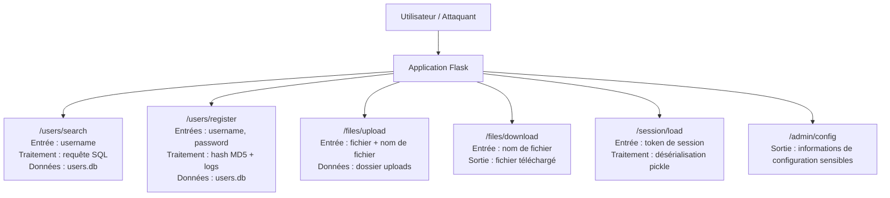

Présentation de l’audit de sécurité du TP1. L’analyse porte sur les flux applicatifs, les vulnérabilités identifiées, leur correspondance avec l’OWASP Top 10, les scripts analysés et les correctifs prioritaires à mettre en œuvre.

# TP1 — Audit de sécurité d’une application Flask vulnérable

## 1. Schéma de flux applicatif

## 2. Vulnérabilités identifiées

| Vulnérabilité                      | OWASP Top 10                                 | Fonction concernée    | Scénario d’exploitation                                                                                            | Gravité  |
| ---------------------------------- | -------------------------------------------- | --------------------- | ------------------------------------------------------------------------------------------------------------------ | -------- |
| Injection SQL                      | A03 — Injection                              | `search_users()`      | Un attaquant peut modifier la requête SQL via le paramètre `username` afin d’accéder à des données non autorisées. | Critique |
| Mot de passe administrateur faible | A07 — Authentication Failures                | `init_db()`           | Le compte administrateur utilise un mot de passe faible et facilement devinable.                                   | Haute    |
| Hash MD5 des mots de passe         | A02 — Cryptographic Failures                 | `hash_password()`     | MD5 est obsolète et vulnérable aux attaques par dictionnaire ou rainbow tables.                                    | Haute    |
| Journalisation des mots de passe   | A09 — Security Logging and Alerting Failures | `register_user()`     | Les mots de passe peuvent apparaître dans les logs applicatifs.                                                    | Haute    |
| Upload de fichier non contrôlé     | A01 — Broken Access Control                  | `upload_file()`       | Un attaquant peut envoyer un fichier avec un nom malveillant et écrire hors du dossier prévu.                      | Haute    |
| Téléchargement non contrôlé        | A01 — Broken Access Control                  | `download_file()`     | Un attaquant peut tenter de lire des fichiers sensibles avec un chemin de type `../`.                              | Haute    |
| Désérialisation non sécurisée      | A08 — Software or Data Integrity Failures    | `load_session()`      | L’utilisation de `pickle.loads()` sur une entrée utilisateur peut permettre l’exécution de code arbitraire.        | Critique |
| Exposition de secrets              | A05 — Security Misconfiguration              | `admin_config()`      | La route expose la clé secrète Flask et le chemin de la base de données.                                           | Haute    |
| Mode debug activé                  | A05 — Security Misconfiguration              | `app.run(debug=True)` | Le mode debug peut exposer des informations techniques sensibles.                                                  | Haute    |

## 3. Détail des scripts analysés

| Script / fonction                              | Élément observé                                                     | Vulnérabilité associée                           |
| ---------------------------------------------- | ------------------------------------------------------------------- | ------------------------------------------------ |
| `APP_SECRET = "super-secret-key-do-not-share"` | Clé secrète écrite en dur dans le code                              | Exposition de secret — OWASP A05                 |
| `init_db()`                                    | Création d’un compte `admin` avec le mot de passe `admin123`        | Authentification faible — OWASP A07              |
| `hash_password()`                              | Utilisation de `hashlib.md5()` pour hacher les mots de passe        | Mauvais mécanisme cryptographique — OWASP A02    |
| `search_users()`                               | Requête SQL construite avec une entrée utilisateur `username`       | Injection SQL — OWASP A03                        |
| `register_user()`                              | Journalisation du mot de passe dans les logs                        | Fuite d’information dans les logs — OWASP A09    |
| `upload_file()`                                | Écriture d’un fichier avec un nom fourni par l’utilisateur          | Upload non contrôlé / path traversal — OWASP A01 |
| `download_file()`                              | Lecture d’un fichier à partir d’un paramètre utilisateur `name`     | Téléchargement non contrôlé — OWASP A01          |
| `load_session()`                               | Utilisation de `pickle.loads()` sur des données reçues en POST      | Désérialisation dangereuse — OWASP A08           |
| `admin_config()`                               | Exposition du chemin de la base, du mode debug et de la clé secrète | Mauvaise configuration — OWASP A05               |
| `app.run(debug=True)`                          | Lancement de Flask en mode debug                                    | Mauvaise configuration — OWASP A05               |

## 4. Les vulnérabilités à corriger
### Top 3 des correctifs prioritaires puis les autres vulnérabilités à corriger : 

### Top 3 des correctifs prioritaires 
 
### 1. Supprimer la désérialisation `pickle`

La priorité numéro 1 concerne la fonction qui utilise `pickle.loads()` sur une donnée fournie par l’utilisateur. Cette vulnérabilité est critique car elle peut permettre à un attaquant d’exécuter du code côté serveur. Elle correspond à l’OWASP A08 — Software or Data Integrity Failures.

Le correctif prioritaire consiste à supprimer l’utilisation de `pickle` pour les données utilisateur. Il faut utiliser un format plus sûr, comme JSON, et valider strictement les champs attendus avant tout traitement.

### 2. Corriger l’injection SQL

La deuxième priorité concerne la route `/users/search`. Cette route utilise une entrée utilisateur dans une requête SQL. Si cette entrée n’est pas correctement contrôlée, un attaquant peut tenter de lire ou d’extraire des données de la base. Cette vulnérabilité correspond à l’OWASP A03 — Injection.

Le correctif consiste à utiliser des requêtes SQL paramétrées. Cela permet de séparer clairement la requête SQL des données saisies par l’utilisateur.

### 3. Sécuriser la configuration, les secrets et les fichiers

La troisième priorité concerne l’exposition d’informations sensibles et la gestion des fichiers. La route `/admin/config` expose la clé secrète Flask, le chemin de la base de données et le mode debug actif. Les routes d’upload et de téléchargement peuvent aussi permettre une lecture ou une écriture de fichiers non autorisée. Ces vulnérabilités correspondent notamment à l’OWASP A05 — Security Misconfiguration et A01 — Broken Access Control.

Les correctifs consistent à supprimer ou protéger la route `/admin/config`, placer les secrets dans des variables d’environnement, désactiver le mode debug, contrôler les extensions de fichiers autorisées et interdire les chemins dangereux comme `../`.

## 5. Corrections proposées pour 5 vulnérabilités

| Vulnérabilité corrigée                            | Correction à appliquer                                                                                                                                | Objectif de sécurité                                         |
| ------------------------------------------------- | ----------------------------------------------------------------------------------------------------------------------------------------------------- | ------------------------------------------------------------ |
| Injection SQL dans `/users/search`                | Remplacer la requête SQL construite avec une entrée utilisateur par une requête paramétrée.                                                           | Empêcher l’injection SQL et protéger la base de données.     |
| Désérialisation dangereuse dans `/session/load`   | Supprimer `pickle.loads()` et utiliser un format sûr comme JSON avec validation stricte des champs.                                                   | Éviter l’exécution de code arbitraire côté serveur.          |
| Hash MD5 des mots de passe                        | Remplacer `hashlib.md5()` par un algorithme adapté au stockage des mots de passe, par exemple `bcrypt` ou `werkzeug.security.generate_password_hash`. | Renforcer la protection des mots de passe.                   |
| Exposition de secrets via `/admin/config`         | Supprimer la route ou la protéger par authentification, et déplacer la clé secrète dans une variable d’environnement.                                 | Éviter la fuite de secrets applicatifs.                      |
| Upload / téléchargement de fichiers non contrôlés | Utiliser `secure_filename()`, vérifier les extensions autorisées et empêcher les chemins contenant `../`.                                             | Empêcher la lecture ou l’écriture de fichiers non autorisés. |

## Conclusion

L’audit met en évidence plusieurs vulnérabilités critiques touchant les données, les secrets, les fichiers et l’exécution côté serveur. Les corrections prioritaires doivent se concentrer sur la suppression de `pickle`, la sécurisation des requêtes SQL, la protection des fichiers et la suppression des secrets exposés.
